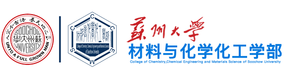

# 苏州大学材料与化学化工学部完全指南

> 养天地正气，法古今完人。

这是一篇苏州大学材化部的本科学习指南，也是对自己大学三年学习生涯的一个纪念。

本指南由苏大材化 22 级学长编写并维护，可以帮助学弟学妹快速了解材化部、高效完成材化部本科专业的学习。如有补充与建议，欢迎评论或邮件 *heyurui@alu.suda.edu.cn*。

---

## 目录

- [如何使用本指南](#如何使用本指南)
- [苏大材化课程](#苏大材化课程)　·　[课程速查表](#课程速查表)　[专业必修](#专业必修)　[专业选修](#专业选修)　[跨专业选修](#跨专业选修)　[通识选修](#通识选修)　[公共基础](#公共基础)　[大类基础](#大类基础)
- [苏大材化资料](#苏大材化资料)
- [苏大材化书籍推荐](#苏大材化书籍推荐)
- [苏大材化学习时光](#苏大材化学习时光)
- [友情感谢](#友情感谢)　·　[声明](#声明)

---

## 如何使用本指南

| 你是… | 建议先看 |
| :--- | :--- |
| 刚入学的萌新 | [材化部基本常识](材化部学习/大一上学期/材化部基本常识.md) → [学习时光 · 大一上](#大一上学期) |
| 想找某门课的资料 | [课程速查表](#课程速查表)（Ctrl+F 搜课名） |
| 想了解某门课怎么学 | 进入对应课程文件夹，看其中的 `README.md`（课程学习建议写在里面） |
| 想推免 / 转专业 / 选课 | [苏大材化资料](#苏大材化资料) |
| 想找课外书 | [苏大材化书籍推荐](#苏大材化书籍推荐) |

> **约定**：每门课程的学习建议（授课老师评价、复习方法、参考书等）统一写在**该课程文件夹下的 `README.md`** 里，同时该文件介绍文件夹内的资料构成与目录树。学位论文模板见 [毕业设计](材化部课程/毕业设计/README.md)。

---

## 苏大材化课程

本节含苏州大学材料与化学化工学部从大一到大四各类课程的学习资料，包括编者自己的试卷及复习笔记，以及材化部历代学长学姐流传下来的课程资料。课程按培养方案分为六大类。

### 课程速查表

下表汇总全部课程，便于按课名快速检索（Ctrl+F）。各课程的详细资料与学习建议见对应文件夹。

| 课程 | 类别 | 课程 | 类别 |
| :--- | :--- | :--- | :--- |
| [无机化学](材化部课程/无机化学/README.md) | 大类基础 | [无机化学实验](材化部课程/无机化学实验/README.md) | 大类基础 |
| [有机化学](材化部课程/有机化学/README.md) | 大类基础 | [有机化学实验](材化部课程/有机化学实验/README.md) | 大类基础 |
| [分析化学](材化部课程/分析化学/README.md) | 大类基础 | [分析化学实验](材化部课程/分析化学实验/README.md) | 大类基础 |
| [物理化学](材化部课程/物理化学/README.md) | 大类基础 | [物理化学实验](材化部课程/物理化学实验/README.md) | 大类基础 |
| [高等数学](材化部课程/高等数学/README.md) | 公共基础 | [普通物理](材化部课程/普通物理/README.md) | 公共基础 |
| [普通物理实验](材化部课程/普通物理实验/README.md) | 公共基础 | [大学英语](材化部课程/大学英语/README.md) | 公共基础 |
| [程序设计及应用（Python）](材化部课程/程序设计及应用（Python）/README.md) | 公共基础 | [计算机信息技术（计算思维）](材化部课程/计算机信息技术（计算思维）/README.md) | 公共基础 |
| [军事技能](材化部课程/军事技能/README.md) | 公共基础 | [军事理论](材化部课程/军事理论/README.md) | 公共基础 |
| [公共体育](材化部课程/公共体育/README.md) | 公共基础 | [健康标准测试](材化部课程/健康标准测试/README.md) | 公共基础 |
| [思想道德与法治](材化部课程/思想道德与法治/README.md) | 公共基础 | [中国近现代史纲要](材化部课程/中国近现代史纲要/README.md) | 公共基础 |
| [马克思主义基本原理](材化部课程/马克思主义基本原理/README.md) | 公共基础 | [习近平新时代中国特色社会主义思想概论](材化部课程/习近平新时代中国特色社会主义思想概论/README.md) | 公共基础 |
| [改革开放史](材化部课程/改革开放史/README.md) | 公共基础 | [形势与政策](材化部课程/形势与政策/README.md) | 公共基础 |
| [思想政治理论课实践](材化部课程/思想政治理论课实践/README.md) | 公共基础 | [大学生心理健康教育](材化部课程/大学生心理健康教育/README.md) | 公共基础 |
| [英语高级视听](材化部课程/英语高级视听/README.md) | 公共基础 | [翻译与英语写作](材化部课程/翻译与英语写作/README.md) | 公共基础 |
| [英语报刊选读](材化部课程/英语报刊选读/README.md) | 公共基础 | [英语高级口语](材化部课程/英语高级口语/README.md) | 公共基础 |
| [英语影视欣赏](材化部课程/英语影视欣赏/README.md) | 公共基础 | [中国特色文化英语教学](材化部课程/中国特色文化英语教学/README.md) | 公共基础 |
| [跨文化交际](材化部课程/跨文化交际/README.md) | 公共基础 | [结构化学（一）](材化部课程/结构化学（一）/README.md) | 专业必修 |
| [化工基础](材化部课程/化工基础/README.md) | 专业必修 | [高分子化学（一）（双语）](材化部课程/高分子化学（一）（双语）/README.md) | 专业必修 |
| [毕业设计](材化部课程/毕业设计/README.md) | 专业必修 | 综合实验（暂无资料） | 专业必修 |
| [习近平总书记关于教育的重要论述研究](材化部课程/习近平总书记关于教育的重要论述研究/README.md) | 专业必修·师范 | [教育学基础教程](材化部课程/教育学基础教程/README.md) | 专业必修·师范 |
| [教育技术与教育科研方法](材化部课程/教育技术与教育科研方法/README.md) | 专业必修·师范 | [学与教的心理学](材化部课程/学与教的心理学/README.md) | 专业必修·师范 |
| [无机合成化学](材化部课程/无机合成化学/README.md) | 专业选修 | [中级无机化学](材化部课程/中级无机化学/README.md) | 专业选修 |
| [现代有机合成新技术](材化部课程/现代有机合成新技术/README.md) | 专业选修 | [高等仪器分析](材化部课程/高等仪器分析/README.md) | 专业选修 |
| [电化学及电分析](材化部课程/电化学及电分析/README.md) | 专业选修 | [材料化学](材化部课程/材料化学/README.md) | 专业选修 |
| [化学专业英语](材化部课程/化学专业英语/README.md) | 专业选修 | [现代化学与研究方法](材化部课程/现代化学与研究方法/README.md) | 专业选修 |
| [量子化学基础](材化部课程/量子化学基础/README.md) | 专业选修 | [绿色化学（英语强化）](材化部课程/绿色化学-英文/README.md) | 专业选修 |
| [文献检索](材化部课程/文献检索/README.md) | 跨专业选修 | [化学品安全与人类健康](材化部课程/化学品安全与人类健康/README.md) | 跨专业选修 |
| [计算机在化学化工及材料中的应用](材化部课程/计算机在化学化工及材料中的应用/README.md) | 跨专业选修 | [化学物质中毒](材化部课程/化学物质中毒/README.md) | 通识选修 |
| [生物安全与人类健康](材化部课程/生物安全与人类健康/README.md) | 通识选修 | [生命与死亡的隧道](材化部课程/生命与死亡的隧道/README.md) | 通识选修 |
| [摄影艺术欣赏与创作](材化部课程/摄影艺术欣赏与创作/README.md) | 通识选修 | | |

> 通识选修中 **文学与艺术类课程不少于 2 学分**。

---

### 专业必修

- [高分子化学（一）（双语）](材化部课程/高分子化学（一）（双语）/README.md)（双语）
- [结构化学（一）](材化部课程/结构化学（一）/README.md)
- [化工基础](材化部课程/化工基础/README.md)
- 综合实验（暂无资料）
- [毕业设计](材化部课程/毕业设计/README.md)（含学位论文模板）
- [习近平总书记关于教育的重要论述研究](材化部课程/习近平总书记关于教育的重要论述研究/README.md)（化学师范）
- [教育学基础教程](材化部课程/教育学基础教程/README.md)（化学师范）
- [教育技术与教育科研方法](材化部课程/教育技术与教育科研方法/README.md)（化学师范）
- [学与教的心理学](材化部课程/学与教的心理学/README.md)（化学师范）

### 专业选修

- [无机合成化学](材化部课程/无机合成化学/README.md)
- [高等仪器分析](材化部课程/高等仪器分析/README.md)
- [化学专业英语](材化部课程/化学专业英语/README.md)
- [电化学及电分析](材化部课程/电化学及电分析/README.md)
- [材料化学](材化部课程/材料化学/README.md)
- [现代有机合成新技术](材化部课程/现代有机合成新技术/README.md)
- [中级无机化学](材化部课程/中级无机化学/README.md)
- [现代化学与研究方法](材化部课程/现代化学与研究方法/README.md)
- [量子化学基础](材化部课程/量子化学基础/README.md)
- [绿色化学（英语强化）](材化部课程/绿色化学-英文/README.md)

### 跨专业选修

- [文献检索](材化部课程/文献检索/README.md)
- [化学品安全与人类健康](材化部课程/化学品安全与人类健康/README.md)
- [计算机在化学化工及材料中的应用](材化部课程/计算机在化学化工及材料中的应用/README.md)

### 通识选修

> 文学与艺术类课程不少于 2 学分。

- [化学物质中毒](材化部课程/化学物质中毒/README.md)
- [生物安全与人类健康](材化部课程/生物安全与人类健康/README.md)
- [生命与死亡的隧道](材化部课程/生命与死亡的隧道/README.md)
- [摄影艺术欣赏与创作](材化部课程/摄影艺术欣赏与创作/README.md)

### 公共基础

- [改革开放史](材化部课程/改革开放史/README.md)
- [大学英语](材化部课程/大学英语/README.md)
- [英语高级视听](材化部课程/英语高级视听/README.md)
- [翻译与英语写作](材化部课程/翻译与英语写作/README.md)
- [军事技能](材化部课程/军事技能/README.md)
- [中国近现代史纲要](材化部课程/中国近现代史纲要/README.md)
- [形势与政策](材化部课程/形势与政策/README.md)
- [公共体育](材化部课程/公共体育/README.md)
- [高等数学](材化部课程/高等数学/README.md)
- [计算机信息技术（计算思维）](材化部课程/计算机信息技术（计算思维）/README.md)
- [大学生心理健康教育](材化部课程/大学生心理健康教育/README.md)
- [英语报刊选读](材化部课程/英语报刊选读/README.md)
- [思想道德与法治](材化部课程/思想道德与法治/README.md)
- [思想政治理论课实践](材化部课程/思想政治理论课实践/README.md)
- [普通物理](材化部课程/普通物理/README.md)
- [程序设计及应用（Python）](材化部课程/程序设计及应用（Python）/README.md)
- [英语高级口语](材化部课程/英语高级口语/README.md)
- [英语影视欣赏](材化部课程/英语影视欣赏/README.md)
- [普通物理实验](材化部课程/普通物理实验/README.md)
- [跨文化交际](材化部课程/跨文化交际/README.md)
- [中国特色文化英语教学](材化部课程/中国特色文化英语教学/README.md)
- [马克思主义基本原理](材化部课程/马克思主义基本原理/README.md)
- [军事理论](材化部课程/军事理论/README.md)
- [习近平新时代中国特色社会主义思想概论](材化部课程/习近平新时代中国特色社会主义思想概论/README.md)
- [健康标准测试](材化部课程/健康标准测试/README.md)

### 大类基础

- [无机化学实验](材化部课程/无机化学实验/README.md)
- [无机化学](材化部课程/无机化学/README.md)
- [有机化学](材化部课程/有机化学/README.md)
- [分析化学实验](材化部课程/分析化学实验/README.md)
- [有机化学实验](材化部课程/有机化学实验/README.md)
- [分析化学](材化部课程/分析化学/README.md)
- [物理化学实验](材化部课程/物理化学实验/README.md)
- [物理化学](材化部课程/物理化学/README.md)

---

## 苏大材化资料

本节以活动 / 事务为单位，涵盖在苏大材化求学可能遇到的各种事情，并附相关建议与文件。

- [材化部推荐免试研究生](材化部资料/材化部推荐免试研究生/README.md)
  - [苏大材化推免去向汇总及建议](材化部资料/材化部推荐免试研究生/苏大材化推免去向汇总及建议.md)
- [材化部推荐入党积极分子](材化部学习/大一上学期/材化部推荐入党积极分子.md)
- [材化部转专业](材化部资料/材化部转专业/README.md)
- [材化部选课](材化部资料/材化部选课/README.md)
- [就业求职简历模板](材化部资料/就业求职简历模板/README.md)
- [课程PPT汇报模板](材化部资料/课程PPT汇报模板/README.md)

---

## 苏大材化书籍推荐

本节涵盖材化学习时应读的好书，可加深对课内课外知识的理解。

- 自然科学类
  - [高数专业相关](材化部书籍/自然科学类/高数专业相关/README.md)
  - [化学专业相关](材化部书籍/自然科学类/化学专业相关/README.md)
  - [物理专业相关](材化部书籍/自然科学类/物理专业相关/README.md)

  

  
一个简略的材化本科专业书籍推荐表

    | 书籍分类 | 中文书籍推荐 | 英文书籍推荐 |
    | :-------: | :-------: | :-------: |
    | 无机化学 | 宋天佑蓝皮无机（吉林大学） | Inorganic Chemistry (Shriver) |
    | 有机化学 | 邢其毅基础有机（北京大学） | Organic Chemistry (McMurry) |
    | 分析化学 | --- | Quantitative Chemical Analysis (Daniel C. Harris) |
    | 量子化学 | 黄明宝量子化学（中国科学院大学） | --- |
    | 物理化学 | 傅献彩物理化学（南京大学） | Atkins' Physical Chemistry (Peter Atkins)|

  

- 考级考证考研
  - [普通话考试](材化部书籍/考级考证考研/普通话考试/README.md)
  - [英语六级（CET-6）](材化部书籍/考级考证考研/英语六级（CET-6）/README.md)

---

## 苏大材化学习时光

以时间线形式，简要介绍各时间段可在材化部完成的事项。**新生推荐先看 [材化部基本常识][CCCEMSbasic]。**

### 大一上学期

- [材化部基本常识][CCCEMSbasic]
- [班委竞选](材化部学习/大一上学期/班委竞选.md)
- [新生军训](材化部学习/大一上学期/新生军训.md)
- [社团及学生组织](材化部学习/大一上学期/社团及学生组织.md)
- [志愿活动换志愿时长](材化部学习/大一上学期/志愿活动换志愿时长.md)
- [教务系统选课](材化部学习/大一上学期/教务系统选课.md)
- [英语四六级考试](材化部学习/大一上学期/英语四六级考试.md)
- [材化部推荐入党积极分子](材化部学习/大一上学期/材化部推荐入党积极分子.md)

### 大一下学期

- [材化部转专业](材化部学习/大一下学期/材化部转专业.md)
- [联系老师进课题组](材化部学习/大一下学期/联系老师进课题组.md)
- [材化部换宿舍](材化部学习/大一下学期/材化部换宿舍.md)

### 大二上学期

- [评奖评优评先](材化部学习/大二上学期/评奖评优评先.md)
- [学科竞赛及三创竞赛](材化部学习/大二上学期/学科竞赛及三创竞赛.md)
- [实验室安全准入考试](材化部学习/大二上学期/实验室安全准入考试.md)

### 大二下学期

- [莙政基金](材化部学习/大二下学期/莙政基金.md)
- [暑期社会实践](材化部学习/大二下学期/暑期社会实践.md)

### 大三上学期

- [考公考编考研选调方向确定](材化部学习/大三上学期/考公考编考研选调方向确定.md)

### 大三下学期

- [教师资格证](材化部学习/大三下学期/教师资格证.md)
- [本科预毕业生图像采集](材化部学习/大三下学期/本科预毕业生图像采集.md)
- [推荐免试攻读研究生](材化部学习/大三下学期/推荐免试攻读研究生.md)

---

## 友情感谢

- 本项目部分课程资料来源于 [@SimonDiana](https://github.com/SimonDiana) 的项目 [CCCEMS-Test](https://github.com/SimonDiana/CCCEMS-Test.git)
- 本项目部分课程资料来源于 QQ群：化学应化资料分享群
- 本项目转专业部分的资料来源于高歌学长 [@Ge Gao](https://github.com/Snowflyt) 的项目 [苏州大学 计算机学院转专业指南](https://github.com/suda-major-change/SUDA-major-change-guide-CS) 和 [苏州大学 转专业通用指南](https://github.com/suda-major-change/SUDA-major-change-guide-universal)
- 感谢 [@Michael Qian (Qi Qian, 钱奇)](https://github.com/QiQian0517) 的项目 [SUDA_WiFi Linux 登陆组件](https://github.com/MichaelQian0517/SUDA_WiFi) 帮助我在 Linux 下登录 SUDA_WiFi
- 感谢 [ZXJ-learner](https://github.com/ZXJ-learner) 提供英语强化班的课程资料

---

## 声明

- 本仓库整理来自公开网络的资料，本人非原创作者，不承担因使用这些资源产生的任何责任，侵权必删。
- 详细声明请参考 [LEGAL.md](LEGAL.md)。

---

## 广告

- **目前沙学长（20级化师） [@SimonDiana](https://github.com/SimonDiana) 在西湖大学理论化学课题组（不同于计算化学，主要是方法开发）学习，有意向了解可私聊。**

---

[***养天地正气 法古今完人***][Website_cccems]

[Website_cccems]: https://chemistry.suda.edu.cn
[CCCEMSbasic]: 材化部学习/大一上学期/材化部基本常识.md
